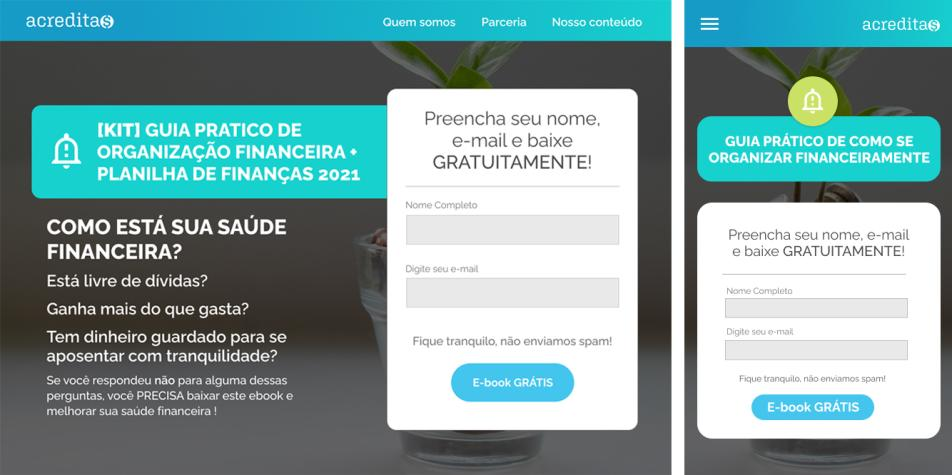

# Acredita$ - Saúde financeira

## Sobre o projeto
Acredita$ é uma empresa fictícia de educação financeira. A landing page da marca foi criada como solução para o assignment *Show Me The Leads*, um projeto do Gama Experience que visa captar leads qualificados para a Creditas.

## A equipe
O grupo GrowthOn é composto por doze pessoas distribuídas em 4 stacks de conhecimento: desenvolvimento front-end (hacker), design UI/UX (hipster), inside sales (hustler) e marketing digital (hyper). Elas são:

- Bruno Nishimura + Bruno Reche + Matheus Azevedo + Matheus Mitestainer // hackers
- Daniel Obara + Larissa Silva // hipsters
- Gabriel Santa Rosa + Matheus Severo // hustlers
- Amanda Dias + Camila Torrent + Carla Takagi + Carol Vieira // hypers

Link do io: https://growthon.github.io/acreditas/
